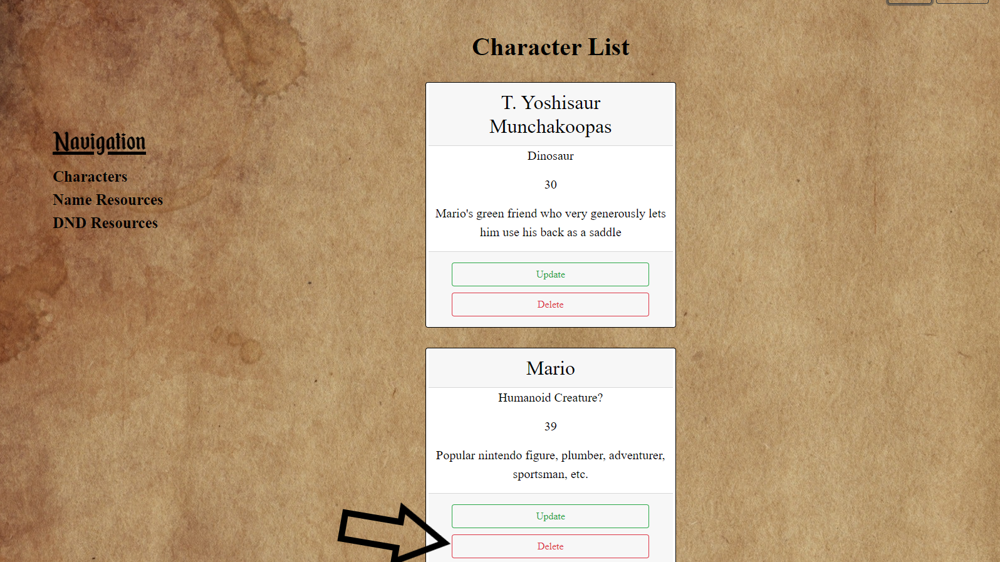

<!-- This project was bootstrapped with [Create React App](https://github.com/facebook/create-react-app).

## Available Scripts

In the project directory, you can run:

### `npm start`

Runs the app in the development mode. 
Open [http://localhost:3000](http://localhost:3000) to view it in the browser.

The page will reload if you make edits. 
You will also see any lint errors in the console.

### `npm test`

Launches the test runner in the interactive watch mode. 
See the section about [running tests](https://facebook.github.io/create-react-app/docs/running-tests) for more information.

### `npm run build`

Builds the app for production to the `build` folder. 
It correctly bundles React in production mode and optimizes the build for the best performance.

The build is minified and the filenames include the hashes. 
Your app is ready to be deployed!

See the section about [deployment](https://facebook.github.io/create-react-app/docs/deployment) for more information.

### `npm run eject`

**Note: this is a one-way operation. Once you `eject`, you can’t go back!**

If you aren’t satisfied with the build tool and configuration choices, you can `eject` at any time. This command will remove the single build dependency from your project.

Instead, it will copy all the configuration files and the transitive dependencies (webpack, Babel, ESLint, etc) right into your project so you have full control over them. All of the commands except `eject` will still work, but they will point to the copied scripts so you can tweak them. At this point you’re on your own.

You don’t have to ever use `eject`. The curated feature set is suitable for small and middle deployments, and you shouldn’t feel obligated to use this feature. However we understand that this tool wouldn’t be useful if you couldn’t customize it when you are ready for it.

## Learn More

You can learn more in the [Create React App documentation](https://facebook.github.io/create-react-app/docs/getting-started).

To learn React, check out the [React documentation](https://reactjs.org/).

### Code Splitting

This section has moved here: https://facebook.github.io/create-react-app/docs/code-splitting

### Analyzing the Bundle Size

This section has moved here: https://facebook.github.io/create-react-app/docs/analyzing-the-bundle-size

### Making a Progressive Web App

This section has moved here: https://facebook.github.io/create-react-app/docs/making-a-progressive-web-app

### Advanced Configuration

This section has moved here: https://facebook.github.io/create-react-app/docs/advanced-configuration

### Deployment

This section has moved here: https://facebook.github.io/create-react-app/docs/deployment

### `npm run build` fails to minify

This section has moved here: https://facebook.github.io/create-react-app/docs/troubleshooting#npm-run-build-fails-to-minify -->

# Character Cache Server

## Landing Page
### The first thing a user sees on the application is the signin. If they already have an account, they can log in. If not, they can create a new account.

### When signing in, a user's password must be at least five characters, otherwise the Sign In button will be disabled

## SignUp
### After clicking the SignUp button, users are greeted by a new screen. They need to input first and last Name, an email, and a password of at least five characters.

### Email addresses must include an @ symbol and text after it.

### Users are unable to create an account if the password is less than 5 characters

### Once all the information is valid, users can click the Create Account button

## Characters
### Once logged in, a user will be shown the character screen. If they have existing characters, those will show up, otherwise there will be an empty space.

### To create a character, one must simply click the Create button

### Characters must have a name, species, age (a positive integer value), and a description

### Characters then show up in the Character List

### Users can update any part of their character simply by selecting the Update button

### Users are able to remove characters by clicking the Delete button. There is also a check to make sure they truly wish to delete that character

### If users decide they don't really want to create or update the character they are currently working on, clicking the x at the top right of either modal will return them to the character page. 

## Resources
### The application also includes helpful resources. Users can find information on name generators and learn about Dungeons and Dragons by clicking one of the links in the Navigation sidebar

## SignOut
### Users also have the ability to sign out by clicking the button appropriately named Sign Out. Doing so will return them to the login screen.

